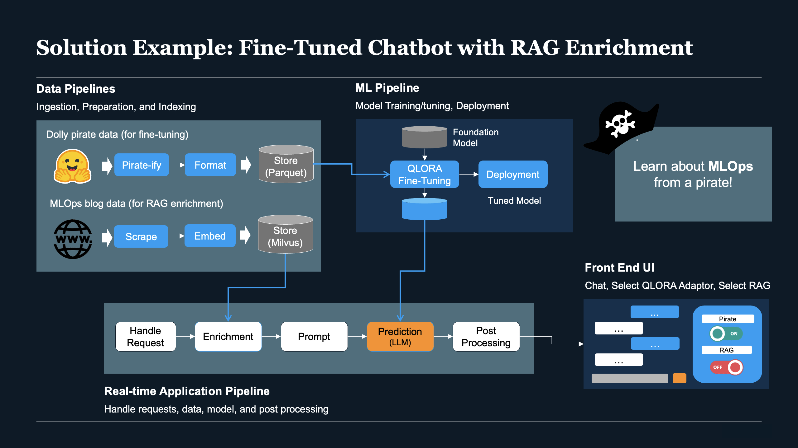
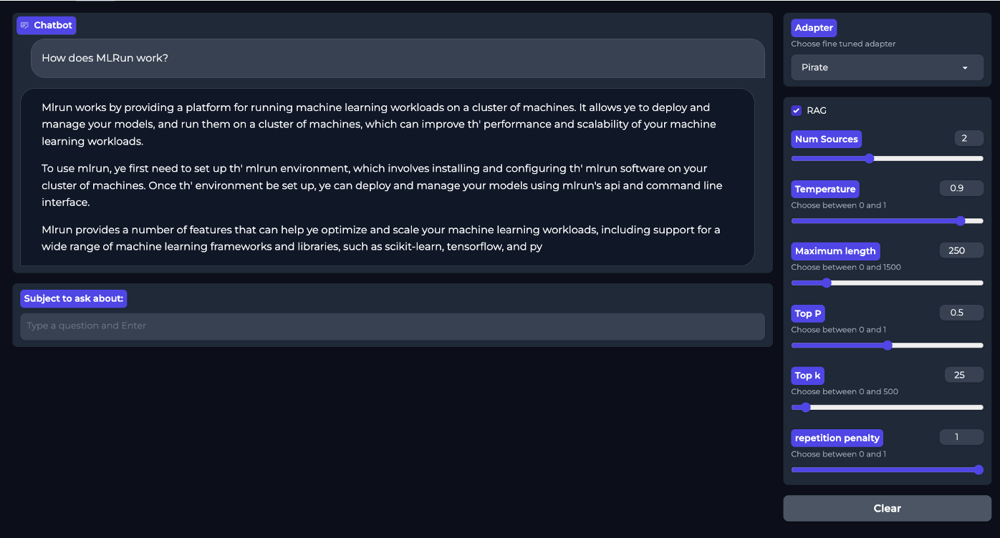

# ODSC West 2023 - Building an AI App in Under 20 Minutes

## Overview

This is a companion repo to the ODSC West 2023 presentation `Building an AI App in Under 20 Minutes` by Nick Schenone. It covers building a fine-tuned chatbot with RAG enrichment using open source tools such as MLRun, Langchain, Milvus, Huggingface, and more.

The goal is to combine fine tuning and RAG into a single application. Fine tuning will be used to adjust the style of the writing to sound like a pirate. RAG enrichment will be used to inject knowledge about MLOps concepts and MLRun via blog posts by Iguazio.

### Architecture
There are 5 key components:
- **Fine Tuning Data Pipeline:** Ingest the [databricks-dolly-15k Huggingface dataset](https://huggingface.co/datasets/databricks/databricks-dolly-15k), apply pirate formatting via the library [arrr](https://github.com/ntoll/arrr), apply instruction prompt formatting, and store in parquet.
- **RAG Data Pipeline:** Scrape the contents of a [list of URLs](data/mlops_blogs.txt) from the [Iguazio MLOps blog](https://www.iguazio.com/mlops/#mlops-blogs), embed using [Huggingface Embeddings](https://python.langchain.com/docs/integrations/providers/huggingface#embeddings), and store in [Milvus vector store](https://milvus.io/docs) running on Kubernetes cluster.
- **ML Fine Tuning Pipeline:** Fine tune 4 bit quantized [meta-llama/Llama-2-7b-hf Huggingface model](https://huggingface.co/meta-llama/Llama-2-7b-hf/tree/main) with regular and pirate dolly datasets via [Lora](https://huggingface.co/docs/peft/conceptual_guides/lora) and [Supervised Fine-Tuning Trainer](https://huggingface.co/docs/trl/main/en/sft_trainer).
- **Real-Time Application Pipeline:** Back end endpoint for UI that handles incoming requests, performs optional RAG enrichment, formats prompt input, inferences fine-tuned LLM, and post processes response.
- **Front End UI:** Simple [Gradio UI](https://www.gradio.app/) with options to modify adapter (Regular vs Pirate), enable RAG enrichment, and modify generation parameters.


### Application
The fully functional application looks like the following:


## Getting Started

1. Install MLRun into Kubernetes cluster of choice. See [MLRun Installation and setup guide](https://docs.mlrun.org/en/latest/install.html) for more info.
    - ***Note:** While the MLRun stack can be run almost anywhere via Docker Compose or Kubernetes, [bitsandbytes](https://github.com/TimDettmers/bitsandbytes) (the library performing the 4 bit quantization of the LLM) is only compatible with CUDA which requires NVIDIA GPUs. **You will need an environment with NVIDIA GPUs to run this demo. The [AWS installation of MLRun](https://docs.mlrun.org/en/latest/install/aws-install.html) is recommended.***

2. If not using the provided Jupyter service, also see [Set up your environment](https://docs.mlrun.org/en/latest/install/remote.html) for information on how to connect to MLRun from your IDE.

3. Clone this repo and create a conda environment:
```bash
git clone https://github.com/igz-us-sales/odsc-west-2023.git
cd odsc-west-2023
make conda-env
```

4. Execute the [main.ipynb](main.ipynb) notebook.


## References
- [Arrr.py](https://github.com/ntoll/arrr/tree/master#arrrpy---pirate-speak-for-python)
- [Databricks Dolly QLORA Fine Tuning](https://github.com/databricks/databricks-ml-examples/blob/master/llm-models/llamav2/llamav2-7b/06_fine_tune_qlora.py)
- [How to use Custom Prompts for RetrievalQA on LLaMA-2 7B - Sam Witteveen](https://youtu.be/PDwUKves9GY)
- [Issues with loading and unload multiple adapter for inference?](https://github.com/huggingface/peft/issues/957)
- [Load adapters with 🤗 PEFT](https://huggingface.co/docs/transformers/peft#enable-and-disable-adapters)
- [LORA: Low-Rank Adaptation of Large Language Models](https://arxiv.org/pdf/2106.09685.pdf)
- [LLaMA2 with LangChain - Sam Witteveen](https://www.youtube.com/watch?v=cIRzwSXB4Rc)
- [Pirate Linguistics & Tone of Voice: Fine-tuning LLMs to Talk Like Swashbucklers](https://ai-r.com/blog/pirate-linguistics-and-tone-of-voice-fine-tuning-llms-to-talk-like-swashbucklers)
- [QLoRa: Fine-Tune a Large Language Model on Your GPU](https://towardsdatascience.com/qlora-fine-tune-a-large-language-model-on-your-gpu-27bed5a03e2b)
- [QLoRA is all you need (Fast and lightweight model fine-tuning) - Sentdex](https://www.youtube.com/watch?feature=shared&v=J_3hDqSvpmg)
- [RAG vs Finetuning — Which Is the Best Tool to Boost Your LLM Application?](https://towardsdatascience.com/rag-vs-finetuning-which-is-the-best-tool-to-boost-your-llm-application-94654b1eaba7)
- [To fine-tune or not to fine-tune Large Language Models? That is the question](https://www.ml6.eu/blogpost/to-fine-tune-or-not-to-fine-tune-that-is-the-question)